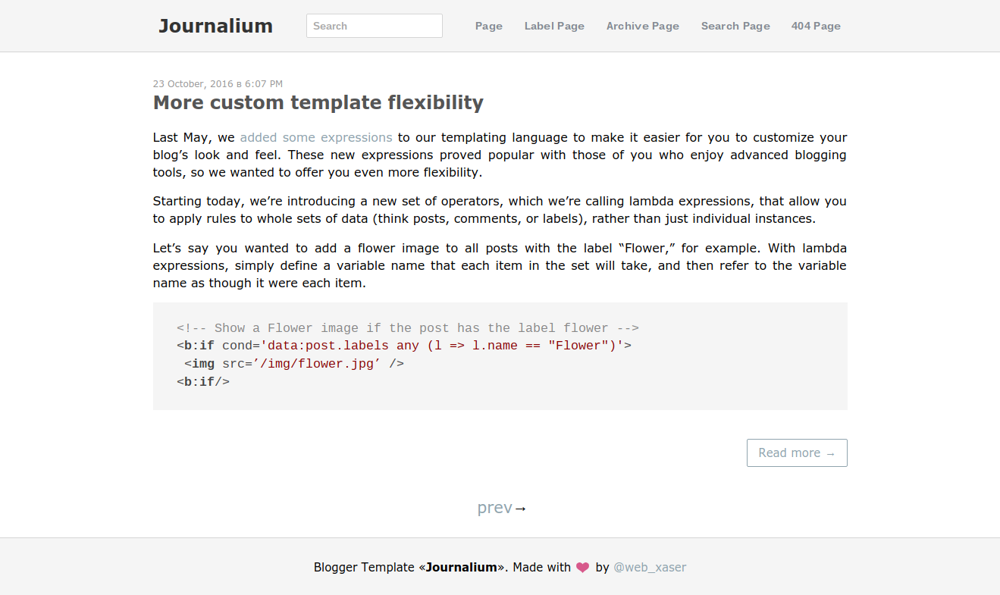
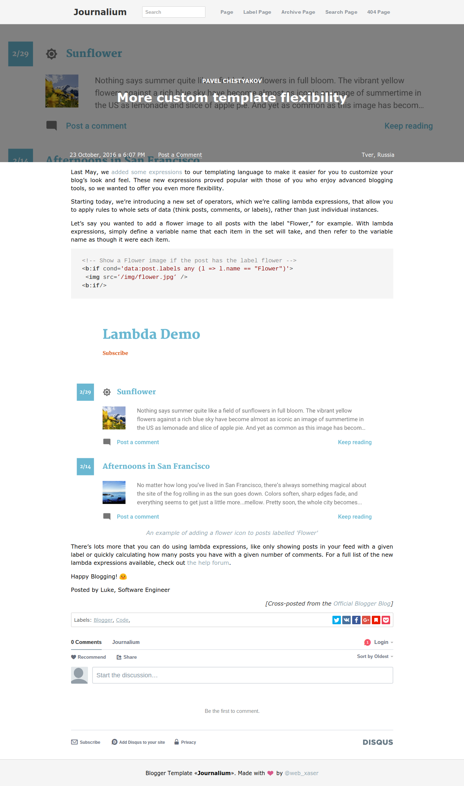
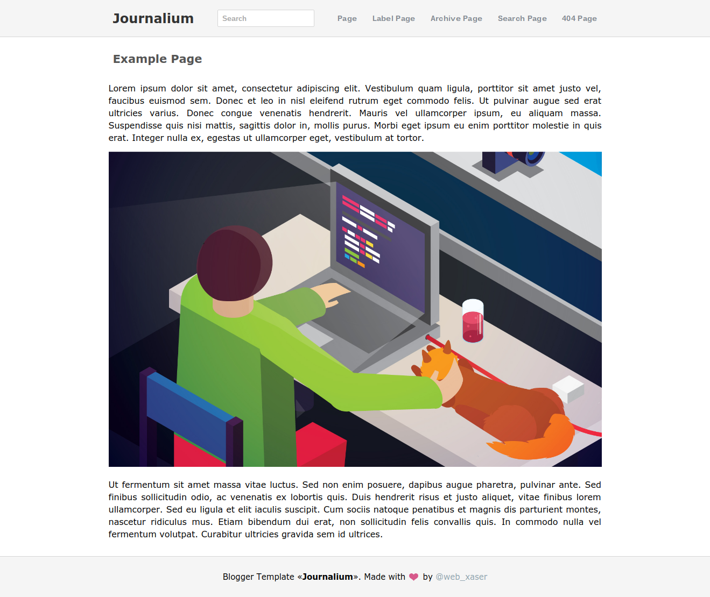
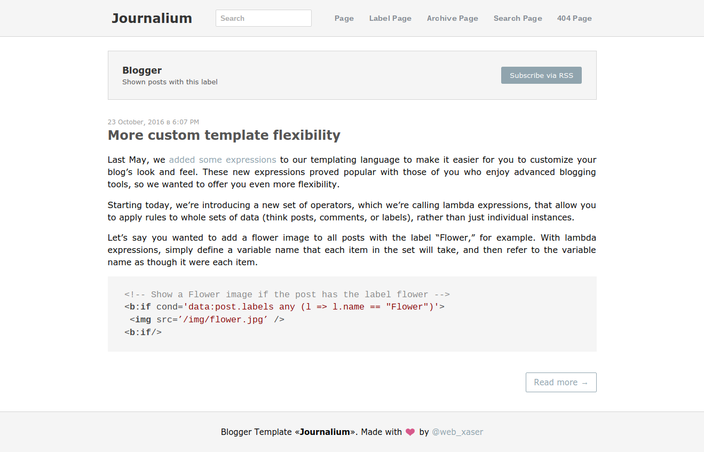
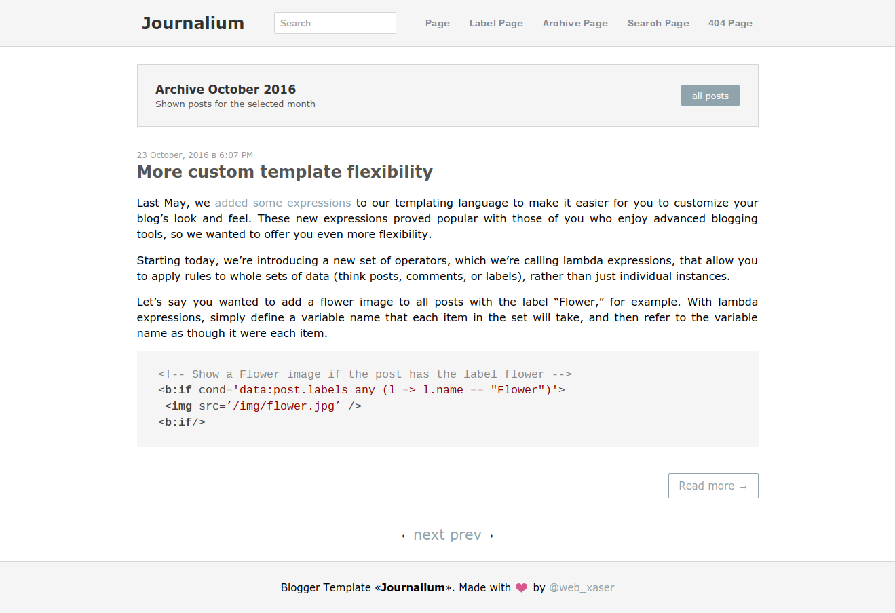
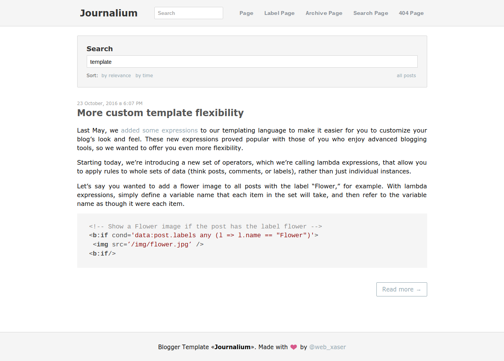
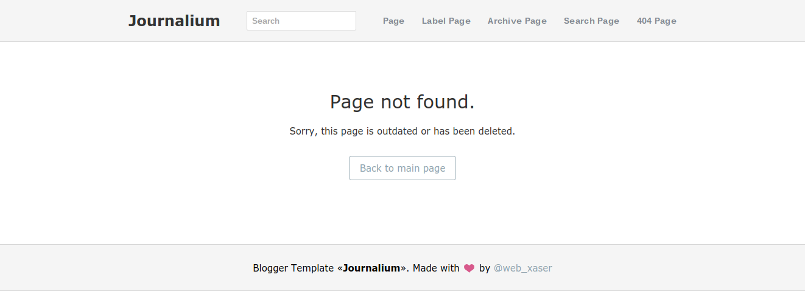

# Journalium  
Journal template for [Blogger/Blogspot](https://www.blogger.com/features).

How to install a template?

1. Download the template
2. Go to your blog template section (Dashboard → Template → "Backup / Restore" button)
3. Backup your previous template ("Download full template" button)
4. Choose the template.xml file and upload it
5. You are awesome :clap:

### Main Page

### Post

### Page

### Labels

### Archive

### Search

### Error Page

